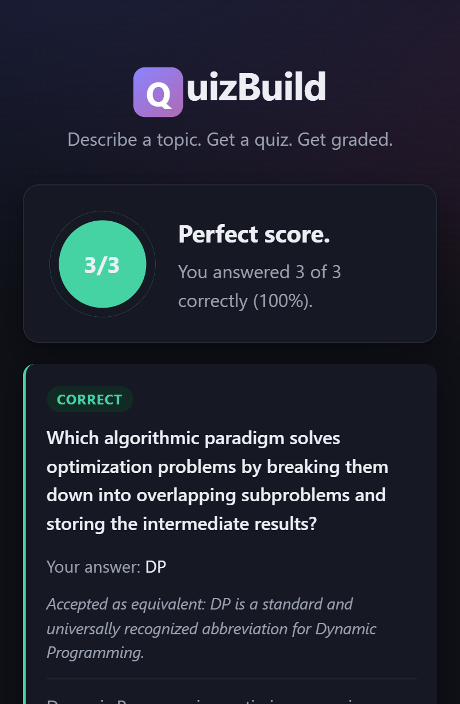

# QuizBuild

[](https://github.com/prnvpjr15/quiz-build/actions/workflows/ci.yml)
[](https://quiz-build-2dm3.onrender.com)
[](package.json)

Turns a plain-text prompt (e.g. "JavaScript closures, medium difficulty") into a structured, gradable quiz using the Gemini API. Every LLM response is validated against a Zod schema and auto-retried with a correction prompt if it doesn't conform, so malformed data never reaches the client.

**Try it: [quiz-build-2dm3.onrender.com](https://quiz-build-2dm3.onrender.com)** — hosted on a free tier, so the first request after a period of inactivity takes ~30 seconds to wake the container.

<!-- Screenshot: capture the results view (score ring + per-question review) at
     roughly 1200px wide, save it as docs/screenshot.png, and uncomment:

-->

## What it does

- **Generates** a quiz from a natural-language topic — multiple choice, true/false, short answer, or mixed
- **Validates** every model response against a Zod schema, re-prompting the model with its own validation errors when it doesn't conform
- **Grades** server-side, including free-text answers, which escalate through normalization → fuzzy matching → a model judge
- **Protects** the paid API behind per-IP rate limits and a service-wide daily spend cap
- **Reports** token usage, cost, latency percentiles, and grading breakdown at `/api/metrics`

## Setup

Get a free API key from [Google AI Studio](https://aistudio.google.com/apikey), then:

```bash
npm install
cp .env.example .env   # then set GEMINI_API_KEY
npm run dev             # or: npm start
```

Then open **http://localhost:3000** — the frontend is served by the same Express process, so there's nothing else to start.

## Testing

```bash
npm test              # node --test
npm run test:coverage
```

No API key is required: the suite substitutes a stub for the model client, so the retry, grading, and rate-limit paths are all exercised offline.

The tests worth reading are the ones covering behaviour that is hard to verify by hand — that a schema correction actually feeds the model its own validation errors, that a 503 doesn't consume a correction attempt, that a quiz is never serialized with its answers attached, and that a judge outage degrades grading instead of failing the submission.

## Architecture

- `src/llmClient.js` — the shared model client. Prompts for JSON, validates against a caller-supplied Zod schema, and retries with the validation errors fed back to the model on failure. Requests use `responseMimeType: 'application/json'` to constrain output to valid JSON syntax; Zod still enforces the actual shape.
  - Two independent retry layers: **schema correction** (bad content is sent back to the model with its validation errors) and **transient-failure backoff** (429/5xx from the API are retried up to 4 times with exponential backoff). A 503 never consumes a schema-correction attempt. If the model stays unavailable, the API returns `503`, not `500`.
- `src/llmService.js` — quiz-specific prompts on top of that client.
- `src/answerJudge.js` — model-based equivalence judging for free-text answers, with an LRU cache.
- `src/textMatch.js` — normalization and Levenshtein similarity, the deterministic half of grading.
- `src/scoring.js` — grades submitted answers server-side against the stored quiz.
- `src/schema.js` — Zod schemas for LLM output and API request/response bodies.
- `src/db.js` — SQLite storage via Node's built-in `node:sqlite`.
- `src/metrics.js` — token, cost, latency, and grading counters.
- `src/middleware/limits.js` — per-IP rate limits and a service-wide daily generation budget.
- `src/routes/quiz.js` — HTTP routes; strips correct answers/explanations before sending a quiz to the client.
- `public/` — static frontend (`index.html`, `styles.css`, `app.js`).

### Grading free-text answers

Exact string comparison marks any correct paraphrase wrong, which was the largest source of incorrect scores. Short answers now escalate through three stages and stop at the first one that settles the question:

1. **Normalized comparison** — case, accents, punctuation, whitespace, and a leading article are folded away. `"The Lexical Environment!"` matches `lexical environment`.
2. **Fuzzy match** — normalized Levenshtein similarity at or above `FUZZY_MATCH_THRESHOLD` (default 0.85) accepts typos and inflections, so `"lexical environments"` passes.
3. **Model judge** — only for answers the first two stages cannot settle. The model sees the question, the reference answer, and the submission, and returns `{correct, reason}` validated against a Zod schema.

The ordering is a cost decision: stages 1 and 2 are free, so the model is consulted only for genuinely ambiguous answers. Judgements are cached per question and normalized answer, so retaking a quiz costs nothing.

The judge is an enhancement, not a dependency. If it is unreachable, grading falls back to the deterministic verdict rather than failing the submission, and `/api/metrics` counts the degradation. Each result carries a `matchType` (`exact`, `fuzzy`, `semantic`, `none`, `unanswered`) so the frontend can explain a verdict the user might otherwise read as arbitrary.

### Abuse and cost controls

The generate endpoint calls a paid API, so it is protected by two independent mechanisms — per-IP rate limits stop one client monopolising the service, and a service-wide daily budget caps total spend however many clients are involved. The budget is counted only after a generation succeeds, so failed calls don't consume it. Reads and grading are limited far more loosely.

Also on by default: `helmet` security headers, a 64kb JSON body cap, CORS off unless `ALLOWED_ORIGINS` is set, and generic 500 responses that return a request id instead of internal error text.

## Frontend

A dependency-free single page (`public/`) served by `express.static`, same-origin with the API so CORS never comes into play. Three states: build → take → results.

- Renders all three question types (radio options, True/False, free-text)
- Sends the type the grader expects — option index, boolean, or string
- Score ring, per-question correct/incorrect review, and the model's explanations
- Explains how a free-text answer was graded when it wasn't a literal match
- Blocks submission while any question is unanswered
- Surfaces a friendly "model is busy" message on `503` rather than a raw error
- Model output is inserted with `textContent`, never `innerHTML`

## Configuration

All optional except the API key — see `.env.example` for the full list with defaults.

| Variable | Default | Purpose |
| --- | --- | --- |
| `GEMINI_API_KEY` | — | Required |
| `GEMINI_MODEL` | `gemini-3.7-flash` | Model id |
| `DB_PATH` | `data/quizzes.db` | SQLite file, or `:memory:` |
| `GENERATE_LIMIT_PER_HOUR` | `10` | Per-IP generation limit |
| `API_LIMIT_PER_15MIN` | `300` | Per-IP limit for all API routes |
| `MAX_DAILY_GENERATIONS` | `200` | Service-wide daily spend cap |
| `FUZZY_MATCH_THRESHOLD` | `0.85` | Similarity needed to skip the judge |
| `PRICE_PER_1M_INPUT_USD` / `PRICE_PER_1M_OUTPUT_USD` | unset | Enables cost reporting |
| `TRUST_PROXY_HOPS` | `1` | Proxy hops to trust for client IPs |
| `ALLOWED_ORIGINS` | unset | Enables CORS for other hosts |

## Docker

```bash
docker build -t quizbuild .
docker run -p 3000:3000 --env-file .env -v quizbuild-data:/app/data quizbuild
```

The volume keeps the SQLite database across redeploys; without it, quizzes are lost when the container is replaced.

### Deploying

The live instance runs on Render from this Dockerfile, with `GEMINI_API_KEY` set as an environment variable and `/health` as the health check path. Attach a persistent disk mounted at `/app/data` — container filesystems are ephemeral, so without one the SQLite database resets on every deploy and previously generated quizzes 404.

## API

### `POST /api/quiz/generate`

```json
{
  "prompt": "JavaScript closures",
  "questionCount": 5,
  "difficulty": "medium",
  "questionType": "multiple-choice"
}
```

`questionType` is one of `multiple-choice`, `true-false`, `short-answer`, or `mixed`. Returns the quiz with answers withheld:

```json
{
  "quizId": "…",
  "title": "…",
  "topic": "…",
  "difficulty": "medium",
  "questions": [
    { "id": "…", "type": "multiple-choice", "question": "…", "options": ["…"] }
  ]
}
```

`GET /api` returns this endpoint list; `GET /health` is a liveness check.

### `GET /api/quiz/:id`

Returns the same answer-hidden shape as above.

### `POST /api/quiz/:id/submit`

```json
{
  "answers": [
    { "questionId": "…", "answer": 2 }
  ]
}
```

`answer` is the option index for `multiple-choice`, a boolean for `true-false`, or a string for `short-answer`. Returns:

```json
{
  "score": 4,
  "total": 5,
  "results": [
    {
      "questionId": "…",
      "correct": true,
      "matchType": "semantic",
      "judgeReason": "Describes the same concept in different words.",
      "userAnswer": "…",
      "correctAnswer": "…",
      "explanation": "…"
    }
  ]
}
```

`judgeReason` is present only when the model judge decided the answer.

### `GET /api/metrics`

Model calls, schema-retry rate, token counts, estimated cost (when pricing is configured), latency percentiles by operation, the short-answer grading breakdown, and stored-quiz counts.
